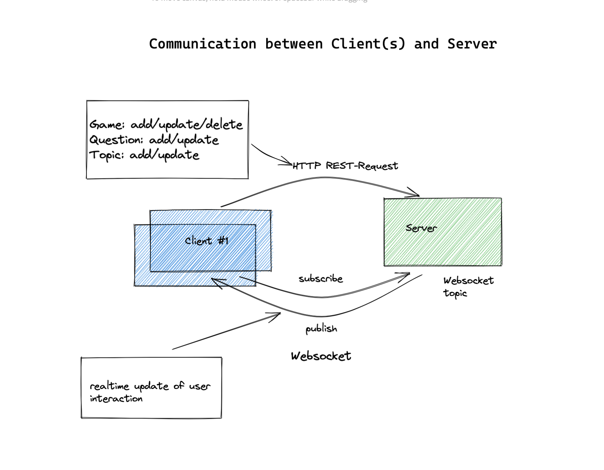

# Patterns and Frameworks (TH Lübeck W22/23) — Gruppe Q
# Projekt: quizlingo 
[](https://github.com/vquynh/quizlingo/actions/workflows/deploy-to-heroku.yml)

In unserem Multiplayer-Game möchten wir den Lernprozess der französischen Sprache spielerisch vorantreiben. Als User kann ich die App nutzen, um gegen andere Spielenden aus der Welt oder Leute aus dem Bekanntenkreis anzutreten und mein Wissen in Sachen Wortschatz und Grammatik unter Beweis stellen. Dabei sollen beide Spieler gleichzeitig an einer Spielrunde teilnehmen können und auf Schnelligkeit die Fragen aus unterschiedlichen Kategorien beantworten. Die Fragen umfassen mehrere Disziplinen, wie zum Beispiel das Hörverständnis oder Grammatik in mehreren Schwierigkeitsstufen. Die Mitspielenden erhalten sofort das Feedback ihres Mitspielenden und können ihren gemeinsamen Lernfortschritt beurteilen.

## Authors
- Jörn Kogerup	
- Thi Viet Quynh Nguyen

## Kommunikation zwischen Client(s) und Server


*Überblick zur Kommunikation zwischen Client(s) und Server*

### Kommunikation über das REST-Protokoll 

#### GameController

```
/**
 * REST-Controller for all game-related requests.
 */
@RestController
public class GameController {
```

```
 /**
 * Sets the gameService for the GameController
 *
 * @param gameService the gameService to be used
 */
public GameController(GameService gameService) {
...
```

```
 /**
 * Sets the gameService for the GameController
 *
 * @param gameService the gameService to be used
 */
public GameController(GameService gameService) {
...
```

```
/**
 * Returns the requested game
 *
 * @param id of the requested game
 * @return GameDTO the requested game
 */
@GetMapping("/games/{id}")
public GameDTO getGame(@PathVariable String id){
    return gameService.getGameById(Long.parseLong(id));
}
```

```
/**
 * Creates a new game and returns the created game
 *
 * @param gameDTO the game to be created that belongs to a certain topic and is played by given users
 * @return GameDTO the created game
 * @throws InvalidNumberOfPlayers thrown when the number of players does not match the number of actual players
 * @throws PlayerNotFoundException thrown when the user given in the GameDTO object can not be found
 */
@PostMapping("/games")
public GameDTO createGame(@RequestBody GameDTO gameDTO) throws InvalidNumberOfPlayers, PlayerNotFoundException {
    return gameService.createGame(gameDTO);
}

```

#### TopicController
```

/**
 * REST-Controller for all topic-related requests
 */
@RestController
public class TopicRestController {
```

```
/**
 * Returns a list of all quiz topics that the user can choose from
 *
 * @return the list of all topics
 */
@GetMapping("/topics")
public List<TopicDTO> getAllTopics(){

    return topicService.getAllTopics();
}
```
```
/**
 * Creates a new topic and returns the created topic
 *
 * @param topicDTO the topic to be created
 * @return topicDTO the created topic
 * @throws TopicAlreadyExistException thrown if the 
 */
@PostMapping("/topics")
@ResponseStatus(HttpStatus.CREATED)
@RolesAllowed(Role.ADMIN)
public TopicDTO create(@RequestBody TopicDTO topicDTO) throws TopicServiceImpl.TopicAlreadyExistException {
    return topicService.createTopic(topicDTO);
}

```
#### QuestionController

```

/**
 * REST-Controller for all question-related requests

 */
@RestController
public class QuestionController {

```

```

/**
 * Returns a list of all quiz questions
 *
 * @return the list of all questions
 */
@GetMapping("/questions")
public List<QuestionDTO> getAllQuestions(){
    return questionService.getAllQuestions();
}
```
```
/**
 * Returns all the questions by a topic
 *
 * @param topic the topic that that questions should belong to
 * @return the list of all questions with the given topic
 */
@GetMapping("/questions/{topic}")
public List<QuestionDTO> getQuestionsByTopic(@PathVariable String topic){
    return questionService.getQuestionsByTopic(topic);
}
```

```

/**
 * Updates a question and returns the updated question
 *
 * @param id the id of question to be updated
 * @param questionCommand the question information that the new question should have
 * @return QuestionDTO the updated question
 */
@PutMapping("/questions/{id}")
public QuestionDTO updateQuestion(@PathVariable Long id, @RequestBody QuestionCommand questionCommand){
    return questionService.updateQuestion(id, questionCommand);
}
```

```

/**
 * Deletes a question
 *
 * @param id the id of question to be deleted
 */
@DeleteMapping("/questions/{id}")
public void deleteQuestion(@PathVariable Long id){
    questionService.deleteQuestion(id);
}
```

```

/**
 * Creates a question and returns the created question
 *
 * @param questionCommand the question information that the new question should have
 * @return QuestionDTO the created question
 */
@PostMapping("/questions")
public QuestionDTO createQuestion(@RequestBody QuestionCommand questionCommand){
    return questionService.createQuestion(questionCommand);
}

```

### Echtzeit-Kommukation mit Websockets
Hierbei handelt es sich um eine interaktive Zwei-Wege-Kommunikationssitzung zwischen dem Browser des Users und dem Game-Server.
Der Client kann Nachrichten an den Websocket senden, um über die Aktivität des Clients zu informieren (z. B. User tritt dem Spiel bei,
User beantwortet die Frage …) und eine ereignisgesteuerte Antwort erhalten, wenn ein User das Spiel aktualisiert.